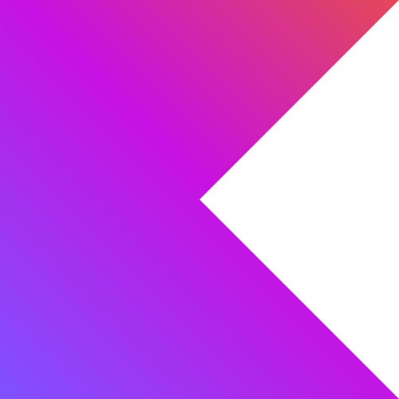
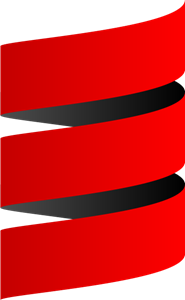
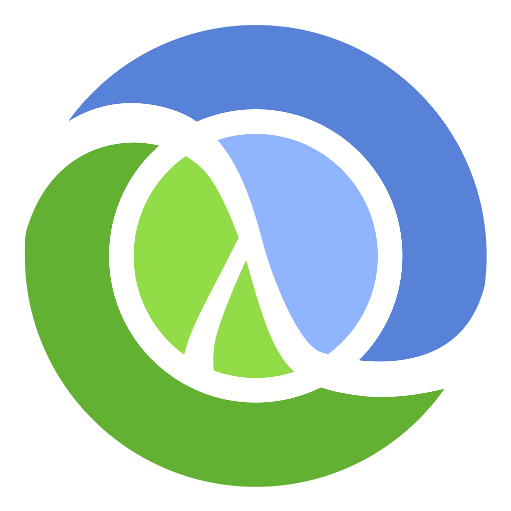
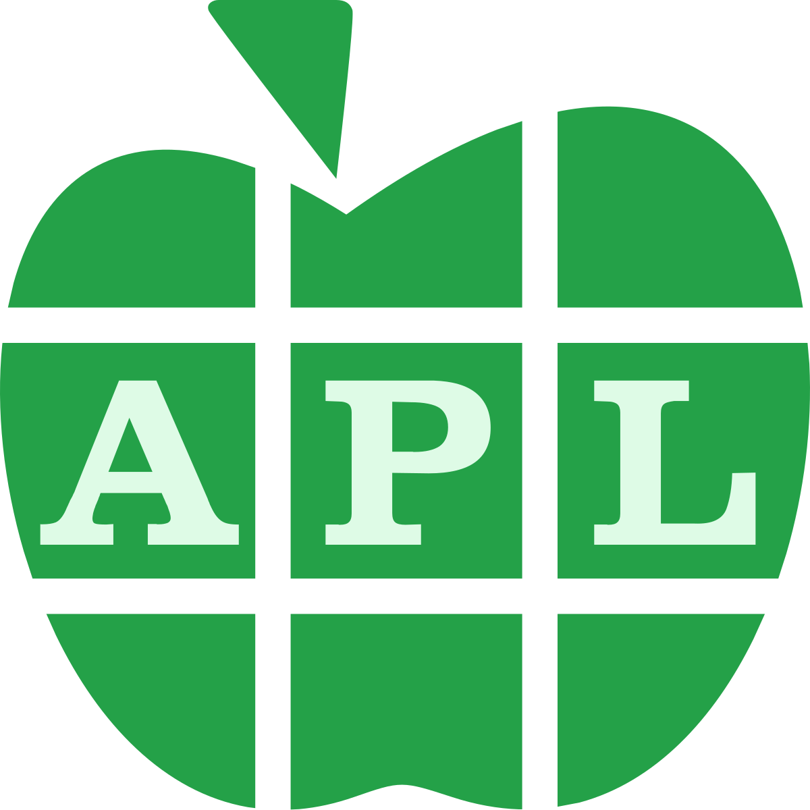

# Hello!

My name is **Hawu**. And now, I shall assault your eyes with emojis to catch your attention.

## General Stuff

My alias "Hawu" is just an unoriginal name from the other name that I also go by, "Haru".

I reside in a certain Asian country, please do not name or my stomach will be ripped. Timezone ranges from +6 to +10 in case of contact.

## Languages

I mean, I learn new things every day. I can't claim I know by heart any languages. All languages kinda have the same very core concepts, just different ways of executing, syntaxes, etc.

Oh, and if you're asking about natural languages, I speak mostly **English**, kinda obvious though.

**Languages that I would be comfortable working with**:

**Languages that I have worked with quite a bit, but not quite THAT comfortable**:

**Languages that I have learned and used quite rarely**:

**Languages that I have tried learning**:

## Goals for now?

Probably just to learn **Rust** better, and maybe **Swift** in near future. My goal is just simply to be flexible and can utilize many tools to get the job done.

Learning new things is always fun, and I'm always open to.
